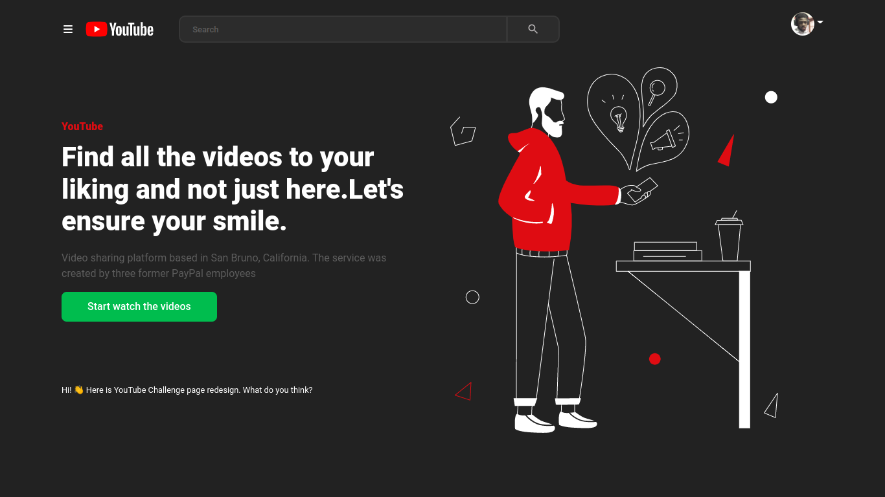

## Desafio 🚀 🚀 🚀

O desafio consiste em criar um projeto com o design da imagem **acima**, utilizando a [API do YouTube](https://developers.google.com/youtube/v3)

Utilize a [documentação](https://developers.google.com/youtube/v3/docs) para se orientar em como criar uma conta, logar no app, listar os vídeos do usuário, se inscrever em canais, enviar vídeos, ou o que mais você precisar.

O layout da **home** não precisa ser exatamente como o do wireframe. Você pode ficar a vontade para exibir os conteúdos/vídeos que achar melhor, desde que qualquer informação (vídeo, texto, cores, imagens) sejam exibidos de maneira organizada e bem distribuida entre a tela, fornecendo uma boa experiência para o usuário.

**Antes de iniciar o teste**
1. Crie um projeto no [console de desenvolvedor](https://console.developers.google.com/projectcreate) da **Google**
2. Ative a [YouTube Data API v3](https://console.developers.google.com/apis/api/youtube.googleapis.com/overview) nele
3. Crie uma credencial de acesso para que seu app possa se comunicar com a API

**Requisitos esperados na entrega do teste**

- [x] Fornecer um mecanismo para o usuário poder pesquisar vídeos
- [x] Possuir home page que exiba algum conteúdo interessante para uma plataforma de vídeos
- [x] Fornecer uma estrutura de gerência do estado da aplicação
- [x] Possuir histórico das buscas realizadas (persistir localmente)

**Requisitos extras** 

- [x] Login através da API do YouTube + OAuth2

## Screens

Home page

Menu de navegação

Outras telas após a execução do mesmo projecto terá o contacto directo

Aproveitando realçar que a API do Youtube tem limite de requisições.

Caso estiver a processar infinitamente é porque o número de requisições foi excedida (API Gateway).
Vai funcionar novamente após 24h.